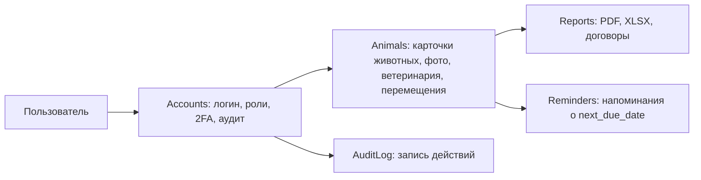

# PawCare / shelter_project2

## Подробное объяснение того, как был разработан проект

PawCare — это Django-система для учёта и сопровождения животных в приюте. Проект решает не одну узкую задачу, а весь рабочий контур приюта: хранение карточек животных, фиксацию ветеринарных действий, учёт перемещений, загрузку фотографий, генерацию PDF/XLSX-отчётов, формирование договоров и организацию доступа сотрудников по ролям. По сути, это прикладная информационная система, а не просто набор страниц с формами.

С технической точки зрения проект построен на классической Django-архитектуре с разделением по приложениям. Это позволяет держать логику пользователей, предметной области и отчётности в отдельных модулях, не смешивая всё в одном файле или одном слое представлений. Такой подход хорошо сочетается с ORM Django, системой шаблонов, миграциями и встроенной административной частью.

## 1. Какие технологии использованы и почему

Основа проекта — Python и Django 4.2. Django выбран потому, что он даёт готовый набор инструментов для типичного бизнес-приложения: модели, формы, представления, маршруты, шаблоны, админку, систему аутентификации и миграции базы данных. Это позволило сосредоточиться не на инфраструктуре, а на предметной области приюта.

Для хранения данных в рабочем окружении используется PostgreSQL. В проекте это видно по настройкам в [shelter/settings.py](shelter/settings.py), где основной движок базы данных задан как PostgreSQL, а параметры берутся из переменных окружения. Такой выбор логичен для системы, где важны устойчивость, транзакционность и нормальная работа при нескольких пользователях одновременно.

Для тестов предусмотрен отдельный режим на SQLite in-memory. Это практичное решение: тесты запускаются быстро, не требуют поднятого PostgreSQL и не зависят от внешней инфраструктуры. В [shelter/settings.py](shelter/settings.py) есть логика определения, запущены ли тесты, и если да, база подменяется на `:memory:`. Это делает разработку и CI заметно проще.

Для генерации документов и выгрузок используются специализированные библиотеки:

- ReportLab — для PDF-отчётов и наложения текста на шаблон договора;
- openpyxl — для формирования XLSX-файлов;
- Pillow — для обработки изображений;
- qrcode — для генерации QR-кода при настройке 2FA;
- django-otp — для двухфакторной аутентификации;
- django-filter — для фильтрации списков;
- crispy-forms и crispy-bootstrap5 — для аккуратного рендеринга форм;
- pypdf — для объединения PDF-шаблонов и накладок, когда оно доступно.

Инфраструктурно проект умеет запускаться как напрямую, так и через Docker Compose. Это означает, что разработчик может работать локально, а пользователь может быстро поднять полноценную среду в контейнерах с PostgreSQL и reverse proxy. Для HTTPS используется Caddy, а для локальной демонстрации есть отдельные скрипты в [scripts/](scripts/).

## 2. Как проект организован по модулям

Вся кодовая база разделена на несколько Django-приложений:

- [accounts/](accounts/) — пользователи, роли, 2FA, аудит, управление профилем;
- [animals/](animals/) — карточки животных, фото, ветеринарные записи, перемещения, напоминания;
- [reports/](reports/) — отчёты, PDF/XLSX-генераторы, договоры;
- [shelter/](shelter/) — общая конфигурация проекта.

Это не просто структурное деление ради порядка. Каждое приложение отвечает за собственный участок данных и поведения. Такой способ разработки соответствует принципу Separation of Concerns: когда логика аутентификации, предметная область и отчёты вынесены отдельно, код легче сопровождать, тестировать и расширять.

Например, если нужно изменить работу с пользователями, разработчик идёт в [accounts/views.py](accounts/views.py) и [accounts/models.py](accounts/models.py). Если требуется изменить правила ведения карточки животного — в [animals/models.py](animals/models.py). Если задача связана с PDF и Excel — в [reports/generators.py](reports/generators.py) и [reports/dogovor_overlay.py](reports/dogovor_overlay.py).

## 3. Общая идея разработки

Проект, судя по структуре, разрабатывался как прикладная учётная система, где важны не визуальные эффекты, а надёжность процессов. Из этого следуют основные технические решения:

- данные хранятся в реляционной базе и описываются моделями Django ORM;
- бизнес-сущности имеют чёткие поля и статусы;
- отчёты генерируются на сервере, а не на клиенте;
- доступ контролируется ролями;
- важные действия логируются в аудит;
- есть механизм двухфакторного входа для повышенной защиты;
- загрузка изображений и документов встроена прямо в рабочий поток.

То есть разработка шла не от «UI ради UI», а от рабочих сценариев приюта: принять животное, зарегистрировать, вести историю, выдать отчёт, оформить передачу, напомнить о процедурe, зафиксировать действия сотрудника.

## 4. Центральная конфигурация проекта

Главный конфигурационный файл — [shelter/settings.py](shelter/settings.py). Именно здесь собраны все ключевые настройки:

- `INSTALLED_APPS` — подключаемые приложения и библиотеки;
- `MIDDLEWARE` — обработчики запросов, включая OTP middleware;
- `TEMPLATES` — шаблоны Django;
- `DATABASES` — подключение к PostgreSQL и тестовая подмена на SQLite;
- `AUTH_USER_MODEL` — собственная модель пользователя;
- `STATIC_URL`, `STATICFILES_DIRS`, `STATIC_ROOT` — статические файлы;
- `MEDIA_URL`, `MEDIA_ROOT` — загружаемые файлы;
- `LANGUAGE_CODE`, `TIME_ZONE`, `USE_TZ` — локаль и часовой пояс;
- `EMAIL_BACKEND`, `EMAIL_HOST`, `EMAIL_PORT` — отправка писем;
- `HTTPS_MODE`, `SECURE_SSL_REDIRECT`, `SESSION_COOKIE_SECURE`, `CSRF_COOKIE_SECURE` — поведение при HTTPS.

Особенно важно, что проект задуман так, чтобы часть параметров можно было поднимать из окружения. Это удобно для Docker и для развёртывания на другой машине: конфигурация не должна быть полностью «зашита» в код.

В том же файле реализован механизм переключения базы данных для тестов. Это технически важное решение: тестовый запуск не должен зависеть от ручной подготовки PostgreSQL, иначе любой прогон станет медленным и хрупким. В проекте это сделано через функцию `_is_running_tests()`, которая проверяет запуск через `test`, `pytest` и переменную `PYTEST_CURRENT_TEST`.

## 5. Пользователи, роли и безопасность

Логика доступа сосредоточена в приложении [accounts/](accounts/). Здесь определена собственная модель пользователя в [accounts/models.py](accounts/models.py), которая расширяет `AbstractUser`.

У пользователя есть:

- `role` — роль, например `admin`, `vet`, `volunteer`;
- `full_name` — полное имя;
- `totp_secret` — секрет для 2FA;
- `is_2fa_enabled` — признак включённой двухфакторной защиты.

Такой подход удобнее стандартного пользователя Django, потому что роли и дополнительные признаки безопасности встроены прямо в сущность пользователя, а не хранятся в разрозненных таблицах и вспомогательных структурах.

Для ограничения доступа используется [accounts/permissions.py](accounts/permissions.py). Там есть функции:

- `has_role(user, *roles)` — проверка роли;
- `role_required(*roles)` — декоратор для защиты views;
- `is_admin(user)` — только администратор;
- `is_vet(user)` — администратор или ветеринар;
- `is_volunteer(user)` — любая из разрешённых ролей.

Это простой, но очень понятный способ внедрить role-based access control. Вместо сложной внешней системы авторизации проект использует собственную ролевую модель на уровне приложения, что хорошо подходит для небольшой и средней рабочей системы.

### Двухфакторная аутентификация

2FA реализована через `django-otp` и `TOTPDevice`. Основная логика находится в [accounts/views.py](accounts/views.py):

- `setup_2fa()` создаёт устройство TOTP, генерирует QR-код и позволяет активировать 2FA;
- `verify_2fa()` проверяет код после логина;
- `disable_2fa()` отключает двухфакторную защиту;
- `login_view()` решает, нужен ли дополнительный шаг подтверждения для `admin` и `vet`;
- `logout_view()` завершает сеанс и пишет запись в аудит.

Сценарий работает так: пользователь вводит логин и пароль, система проверяет учётные данные, и если это администратор или ветеринар с настроенным устройством, он переносится на страницу проверки OTP-кода. Если кода нет или устройство не настроено, система сообщает об ошибке. Такой поток защищает наиболее чувствительные роли.

Генерация QR-кода сделана через `qrcode`: в `setup_2fa()` URL конфигурации TOTP превращается в изображение, которое можно отсканировать мобильным приложением-генератором кодов.

### Аудит действий

В [accounts/models.py](accounts/models.py) есть модель `AuditLog`, которая хранит:

- пользователя;
- действие;
- время;
- детали.

Это важная часть разработки, потому что система приюта должна оставлять след действий: кто вошёл, кто создал животное, кто изменил профиль, кто экспортировал данные, кто отключил 2FA. Такой журнал помогает контролировать изменения и диагностировать ошибки в рабочем процессе.

Записи аудита создаются через вспомогательную функцию `log_action()` из [accounts/utils.py](accounts/utils.py), а просмотр и экспорт сделаны во view `audit_log()` в [accounts/views.py](accounts/views.py). Экспорт формируется в CSV, при этом в файл добавляется BOM, чтобы Excel корректно отображал русский текст.

## 6. Основная предметная область: животные, фото, ветеринария и перемещения

Главное приложение проекта — [animals/](animals/). Именно здесь реализована основная бизнес-логика приюта.

### Модель Animal

В [animals/models.py](animals/models.py) описана модель `Animal`. В ней зафиксированы не только базовые данные, но и вся рабочая карточка животного:

- вид (`species`);
- кличка (`name`);
- порода (`breed`);
- пол (`sex`);
- дата рождения или примерный возраст;
- окрас и особые приметы;
- дата поступления;
- источник поступления;
- текущий статус;
- кто создал запись;
- даты создания и обновления.

Статусы подобраны так, чтобы отражать реальную жизненную цепочку животного: приём, карантин, здоровье, лечение, готовность к усыновлению, усыновление, передача, смерть. Это значит, что разработка опиралась не на абстрактную таблицу, а на реальный рабочий процесс приюта.

Особое внимание заслуживает метод `Animal.save()`. Он автоматически генерирует `unique_id` в формате `AN-0001`, `AN-0002` и так далее, если номер не был задан вручную. Это упрощает жизнь пользователям: они видят понятный идентификатор животного без необходимости вводить его самим.

Технически это сделано через поиск последнего животного в базе, извлечение числовой части и увеличение номера на единицу. Решение простое и удобное для небольшого проекта. Его нужно учитывать при высокой конкуренции запросов, но для сценария приюта оно вполне практично.

### Фото животных

Модель `Photo` хранит изображения животных. Поле `image` использует `upload_to='animals/%Y/%m/'`, то есть файлы складываются по годам и месяцам. Это хороший способ не держать все загрузки в одном каталоге и не терять упорядоченность со временем.

Привязка фото к животному через `related_name='photos'` позволяет сразу получать все изображения конкретной карточки и использовать их в шаблонах и представлениях.

### Ветеринарные записи

Модель `VetRecord` фиксирует все ветеринарные действия:

- дату;
- тип процедуры;
- описание;
- имя ветеринара;
- email сотрудника;
- следующую дату обработки;
- время создания записи.

Это уже не просто список посещений, а полноценный журнал медицинского сопровождения. У модели есть метод `is_overdue()`, который проверяет, просрочена ли следующая обработка. Это важный кусок прикладной логики: он нужен и для отчётов, и для напоминаний.

### Перемещения животных

Модель `Movement` фиксирует перемещения животного внутри системы учёта: поступление, перевод, усыновление, смерть, передачу в другой приют. Поля `from_location`, `to_location`, `reason` и `notes` дают сотруднику контекст и объяснение, почему изменился статус животного.

Именно эта модель используется при генерации договоров и журналов перемещения. Такой дизайн показывает, что проект строился как инструмент полного жизненного цикла животного, а не только как справочник карточек.

## 7. Напоминания и фоновые действия

Отдельный модуль [animals/reminders.py](animals/reminders.py) реализует отправку напоминаний о предстоящих ветеринарных обработках. Это небольшой, но очень полезный сервисный слой.

Функция `send_vet_due_reminders()` делает следующее:

- определяет текущую дату с учётом часового пояса;
- вычисляет целевую дату через заданное число дней;
- выбирает записи `VetRecord` с соответствующим `next_due_date`;
- проверяет, указан ли email получателя;
- отправляет письмо через `django.core.mail.send_mail`;
- считает, сколько записей обработано, отправлено и пропущено.

Возвращаемый `RemindersResult` содержит три счётчика. Это хорошее решение, потому что функцию можно использовать не только для отправки, но и для логирования или диагностики. Такой дизайн легче тестировать, чем «тихий» код без результата.

По сути, разработчики встроили упрощённый фоновой механизм без тяжёлой очереди задач. Для текущего масштаба это разумно: нет лишней инфраструктуры, но есть автоматическая отправка напоминаний.

## 8. Генерация отчётов и документов

Приложение [reports/](reports/) — одна из самых технически интересных частей проекта. Здесь видно, как разработка шла от потребности получать документы сразу в нужном формате.

### PDF и Excel-отчёты

В [reports/generators.py](reports/generators.py) реализованы генераторы нескольких типов документов:

- отчёт по поступлениям животных в PDF и XLSX;
- отчёт по ветеринарным мероприятиям в PDF и XLSX;
- отчёт по перемещениям в PDF и XLSX;
- договоры передачи и усыновления в PDF.

PDF-отчёты создаются через ReportLab. В коде используются:

- `SimpleDocTemplate` — сборка документа;
- `Table`, `TableStyle`, `Paragraph`, `Spacer` — оформление содержимого;
- `ParagraphStyle` — стилизация текста;
- `A4` и `landscape(A4)` — формат страницы;
- регистрация шрифта `DejaVuSans` для корректного русского текста.

Excel-отчёты создаются через openpyxl. Это позволяет формировать таблицы, заполнять строки и автоматически подгонять ширину столбцов через вспомогательную функцию `_autosize_columns()`.

### Почему отчёты делались на сервере

Серверная генерация документов удобна в прикладной системе по нескольким причинам. Во-первых, данные уже лежат в БД и доступны через ORM. Во-вторых, результат можно сразу скачать. В-третьих, не нужен отдельный экспортный клиент и не приходится вручную собирать отчёт в Excel.

Для сотрудника приюта это выглядит просто: задать дату или диапазон дат и получить готовый файл.

### Договоры по шаблону

Самая специфическая часть — работа с PDF-договором. В проекте это реализовано через [reports/dogovor_overlay.py](reports/dogovor_overlay.py) и `render_dogovor_from_template()`.

Логика здесь такая:

1. Берётся готовый шаблон PDF `dogovor.pdf`.
2. Считывается размер и количество страниц шаблона.
3. Из `reports/dogovor_placements.json` загружаются координаты, куда нужно поставить текст.
4. Через ReportLab строится overlay-PDF с текстом в нужных точках.
5. Через `pypdf` overlay накладывается на шаблон.

Это очень показательный пример разработки «под реальный документ». Проект не просто создаёт PDF с нуля, а работает с уже существующим бумажным шаблоном, который надо заполнить по координатам. Такой подход часто используется в системах, где юридический или организационный документ уже стандартизирован.

Файл [reports/dogovor_overlay.py](reports/dogovor_overlay.py) содержит функции:

- `load_placements()` — загрузка координат;
- `build_overlay_pdf()` — построение слоя с текстом;
- `merge_template_with_overlay()` — объединение базового PDF и overlay;
- `render_dogovor_from_template()` — итоговый пайплайн генерации.

В [reports/generators.py](reports/generators.py) над этим построены `generate_movement_contract_pdf()` и `generate_adoption_contract_pdf()`. Они собирают значения из модели животного и перемещения, затем передают их в шаблонную генерацию.

## 9. Формы, шаблоны и пользовательский интерфейс

Интерфейс проекта сделан в классическом Django-стиле: серверный рендеринг шаблонов, формы на backend и немного JavaScript для удобства. Такой подход очень хорошо подходит для внутренней рабочей системы, где важнее предсказуемость и простота, чем сложный frontend-фреймворк.

В проекте используются:

- Django templates в [templates/](templates/);
- кастомные стили в [static/css/style.css](static/css/style.css);
- JavaScript в [static/js/script.js](static/js/script.js);
- шрифты и иконки в [static/](static/);
- собранная статика в [staticfiles/](staticfiles/).

Формы улучшаются через crispy-forms и Bootstrap 5. Это ускоряет разработку, потому что не нужно вручную выстраивать каждый input. Для типового CRUD-интерфейса это практичное решение.

Функции вроде `get_next_url()` и `redirect_next_or()` из [animals/view_utils.py](animals/view_utils.py) показывают, что разработка шла и в сторону улучшения пользовательских переходов: после действия можно вернуть человека на заранее заданную страницу, а не всегда отправлять его на один и тот же маршрут.

## 10. Как устроен поток данных в проекте

Если смотреть на систему как на поток, то разработка выстроена довольно последовательно.

Пользователь проходит аутентификацию через `accounts`. Затем, в зависимости от роли, получает доступ к нужным страницам. После этого он работает с карточками животных в `animals`, где создаются записи, фото, ветеринарные осмотры и перемещения. Если нужна печать документа или выгрузка, данные передаются в `reports`, где формируется PDF или Excel. Параллельно события пишутся в аудит, а отдельный механизм напоминаний следит за датами обработок.

Если представить это в виде цепочки, то она выглядит так:

Такой поток хорошо показывает, что проект строился как единая прикладная система, где каждый модуль имеет своё место и не дублирует чужую ответственность.

## 11. Развёртывание и окружение

Проект предусмотрительно снабжён несколькими способами запуска. Это заметный признак зрелой разработки.

Есть Dockerfile и docker-compose.yml, которые поднимают веб-приложение и PostgreSQL, а также дополнительные сервисы, включая Caddy и напоминания. Это даёт воспроизводимое окружение и позволяет запускать проект на другой машине без ручной настройки всех зависимостей.

Есть и сценарии для локального запуска в Windows: виртуальное окружение, установка зависимостей, миграции, `collectstatic`, `runserver`. Кроме того, в [scripts/](scripts/) есть скрипты для генерации локальных сертификатов, доверия сертификату, открытия HTTPS-порта и запуска HTTPS-сервера.

Такой набор утилит говорит о том, что проект делали с прицелом не только на код, но и на удобство развёртывания.

## 12. Что показывает внутренняя реализация

По коду видно несколько важных инженерных решений.

Во-первых, проект держится на ORM Django и использует модели как основную точку описания данных. Это видно по `Animal`, `VetRecord`, `Movement`, `Photo`, `User`, `AuditLog`.

Во-вторых, логика не распылена по шаблонам. Основные вычисления сосредоточены во view и вспомогательных функциях. Например, в `login_view()` решается, нужен ли 2FA; в `send_vet_due_reminders()` решается, кому и когда отправлять письмо; в `Animal.save()` решается, как присвоить уникальный номер; в `render_dogovor_from_template()` решается, как заполнить PDF-шаблон.

В-третьих, проект явно делался с расчётом на реальные рабочие данные: есть аудит, даты, статусы, фильтры, экспорт, шаблоны документов и автоматизация напоминаний. Это не учебный каркас, а функциональная система с прикладными процессами.

## 13. Краткий итог

Если описать разработку проекта коротко, но по сути, то она шла так:

1. Сначала была определена предметная область приюта: животные, ветеринария, перемещения, пользователи, документы.
2. Затем данные были разложены по Django-приложениям, чтобы каждый блок отвечал за свою часть системы.
3. После этого были добавлены модели и бизнес-правила: статусы животных, автонумерация, ветзаписи, аудит, роли.
4. Потом подключили отчёты, генерацию PDF/XLSX и заполнение договоров по шаблону.
5. Затем добавили безопасность: роли, 2FA, журналирование, HTTPS-настройки.
6. Наконец, проект сделали удобным для развёртывания через Docker, локальные скрипты и отдельный тестовый режим на SQLite.

Именно поэтому PawCare выглядит как законченное прикладное решение: в нём связаны база данных, бизнес-логика, отчёты, безопасность и инфраструктура. Каждая часть проекта не просто присутствует, а обслуживает конкретный реальный сценарий работы приюта.
